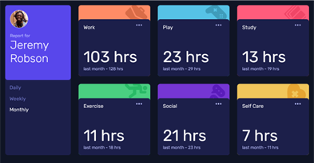
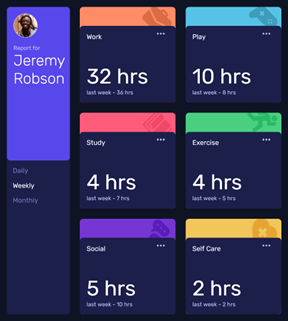

# Frontend Mentor - Time tracking dashboard solution

This is a solution to the [Time tracking dashboard challenge on Frontend Mentor](https://www.frontendmentor.io/challenges/time-tracking-dashboard-UIQ7167Jw). Frontend Mentor challenges help you improve your coding skills by building realistic projects. 

## Overview

### The challenge

Users should be able to:

- View the optimal layout for the site depending on their device's screen size
- See hover states for all interactive elements on the page
- Switch between viewing Daily, Weekly, and Monthly stats

### Screenshot





### Links

- Solution URL: [https://github.com/toshirokubota/time-tracking-dashboard](https://github.com/toshirokubota/time-tracking-dashboard)
- Live Site URL: [https://toshirokubota.github.io/time-tracking-dashboard/](https://toshirokubota.github.io/time-tracking-dashboard/)

## My process

### Built with

- Semantic HTML5 markup
- CSS custom properties
- Flexbox
- CSS Grid
- Mobile-first workflow

### What I learned

- In this project, I was able to implement the javascript relatively quickly, thanks to the tutorial/example provided in the Javascript learning path.

- I was able to appy the grid layout on the main page including the user profile card. I was able to change the layout from 1 conlumn all the way to 4 columns based on the screen size. I wanted to automatically stretch the user profile card for the entire column, but I was not able to have 
```css
grid-row: 1/-1;
```
working. Maybe I cannot use the negative grid line number when the placement is done dynamically? (because the number of rows is not known beforehand.)
So I ended up preparing each layout with media query.

### Continued development

- I will continue on the Javascript learning path and try to become more proficient in the scripting and layouting.

### Useful resources

## Author

## Acknowledgments
